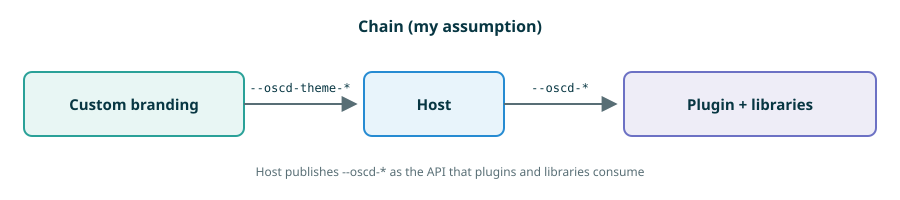
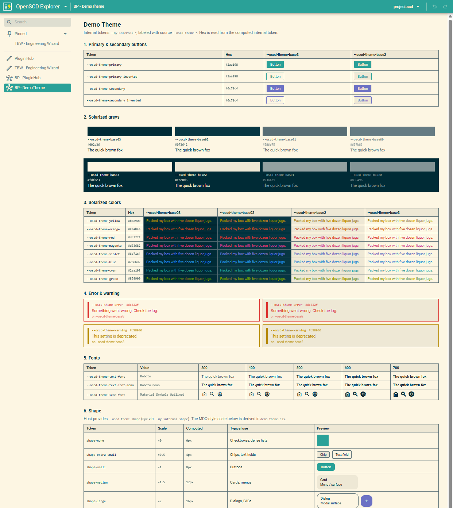

# ADR-0005 — Server-side customer branding and a portable theme contract

Date: 2026-08-21 (updated 2026-09-06)

## Status

Proposed

This ADR is for the **whole OpenSCD ecosystem** (oscd-shell, CoMPAS, and other hosts). CoMPAS-specific host changes (`themes.ts`, Settings, nav tokens) were moved to [0005-customer-branding-and-dark-mode-compas.md](0005-customer-branding-and-dark-mode-compas.md).

## Server-side corporate design is hard to ship

`--oscd-theme-*` exists, but the contract is unclear: which tokens a distro may set, how they relate to `--oscd-*` / `--md-*` / `--mwc-*`, and how light/dark is supposed to work. There is no shared host or plugin how-to.

The portable input is `--oscd-theme-*`.
How-tos ([customer-branding.md](../how-to/customer-branding.md), [plugin-theming.md](../how-to/plugin-theming.md)) are **new** with this ADR and were written for CoMPAS.
Community pointer: [`openscd/oscd-api` `docs/theming.md`](https://github.com/openscd/oscd-api/blob/main/docs/theming.md).

## Terminology and misunderstandings

### Names

In recent meetings the names I used were incorrect.

| Name | Means |
|---|---|
| **CoMPAS** | Both https://github.com/com-pas/open-scd and https://github.com/com-pas/compas-open-scd (the CoMPAS GitHub org). |
| **OpenSCD** | The wider ecosystem. It includes **oscd-shell** and **CoMPAS**, not only one of those hosts. |

When contrasting the two hosts, call the CoMPAS implementation **compas-open-scd**, not “OpenSCD”.

### Token layers (chain vs fork)

The stylesheet tokens were also misunderstood.

**Assumed (chain):** custom branding sets `--oscd-theme-*` for the host. The host consumes them and publishes `--oscd-*` as the plugin API.

**Intended (fork):** custom branding sets `--oscd-theme-*` for **both** the host and the plugins. Each side maps that palette into its own UI stack. Plugins must not depend on the host having published `--oscd-*`.

`--oscd-*` on the host is host-distribution internals (and for compatibility for old plugins). `--oscd-*` inside a plugin that uses oscd-ui is a **library convention**, not the portable contract. A planned rename of that library prefix is `--oscd-ui-*`.

## Next steps

### CoMPAS

- Adopt the same token schema / layering as oscd-shell, backward-compatibly (host still publishes `--oscd-*` so existing plugins keep working). See the [CoMPAS annex](0005-customer-branding-and-dark-mode-compas.md).
- Token mapping should stay close to [`oscd-shell-design-tokens.ts`](https://github.com/OMICRONEnergyOSS/oscd-shell/blob/main/src/oscd-shell-design-tokens.ts).
- Ship a **Demo Theme** plugin so a distro can check that its `--oscd-theme-*` config is correct.
	Current SNAPSHOT embedded in oscd-shell:
	

### oscd-shell / oscd-ui

- Likely only a rename of oscd-ui tokens from `--oscd-*` to `--oscd-ui-*`, so they are not confused with host `--oscd-*`. That change affects plugins that use oscd-ui (contract between plugin and oscd-ui), not the portable `--oscd-theme-*` contract.

## Future steps

### Sync the plugin API

The plugin API has drifted over time:

- oscd-api: https://github.com/openscd/oscd-api/blob/main/src/Plugin.ts
- CoMPAS host: https://github.com/com-pas/compas-open-scd/blob/main/src/addons/CompasLayout.ts#L72-L90

Example: PluginHub and the Engineering Wizard need an extra input (`plugins`) that is not in the shared API.

This needs more time in the field to see which properties can still be unified. I need more experience for that, a proposal is months away, not part of this branding work.
