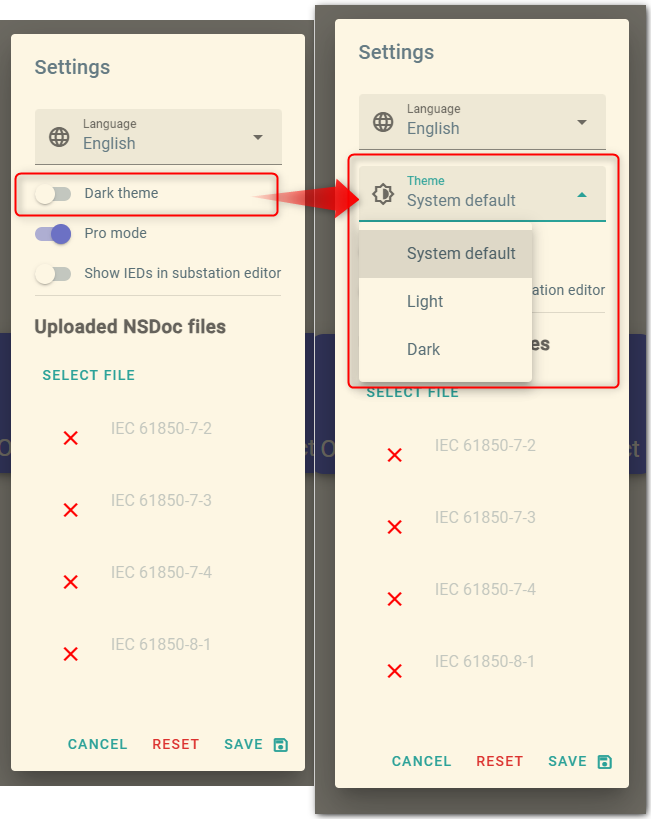
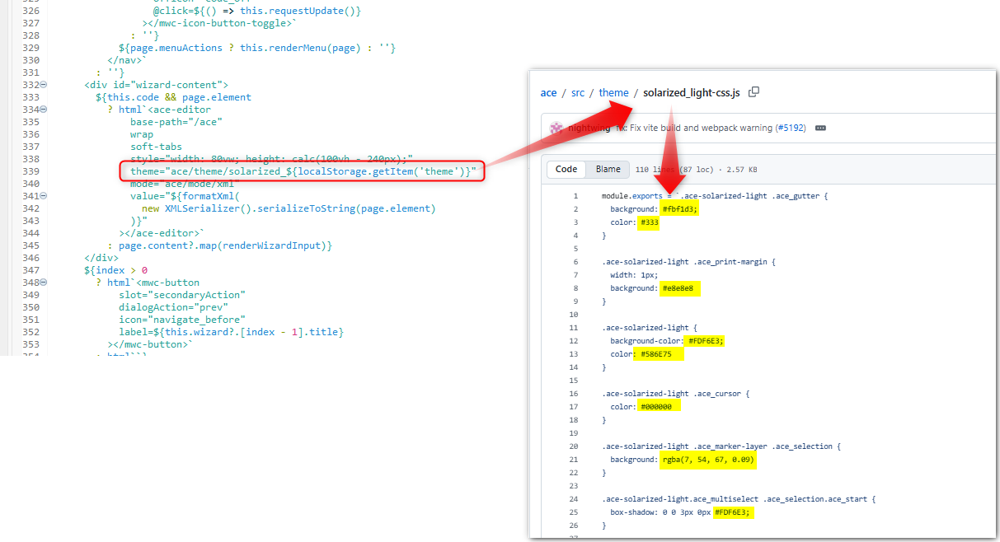
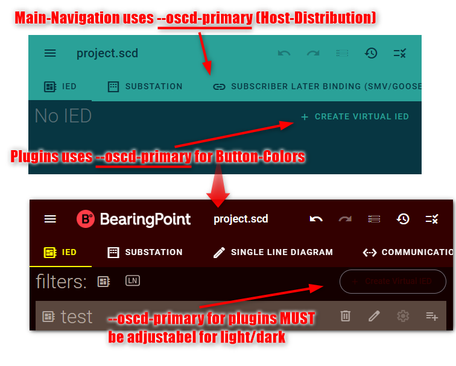
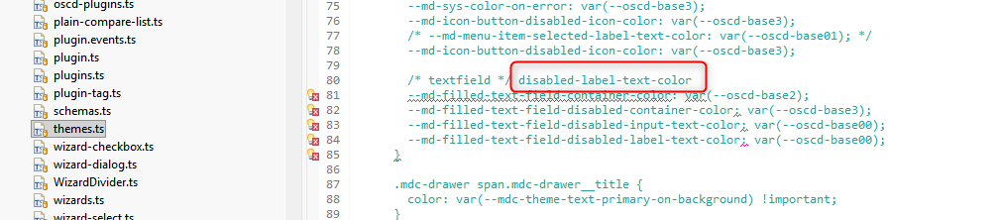
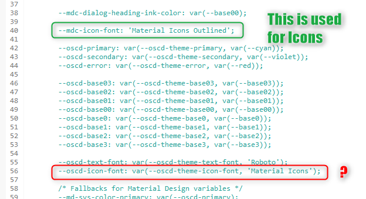

# ADR-0005 — Server-side customer branding and a working light/dark split

Date: 2026-08-21

## Status

Proposed

## Current problems

### Server-side corporate design is hard to ship

`--oscd-theme-*` exists in OpenSCD, but the contract is unclear: which tokens to set, how they relate to `--oscd-*` and `--mdc-*`, and how light/dark is supposed to work.
There is no host or plugin how-to. Distros fall back to forking or monkey-patching `themes.js`.

### Dark mode is de facto not implementable

OpenSCD light/dark is a 1:1 [Solarized](https://ethanschoonover.com/solarized/) inversion: two stylesheets swap unprefixed `--base03` … `--base3`. That works only while nobody overrides the palette.

- A single hex on `--oscd-theme-base*` is used in both modes, so the split disappears.
- `--oscd-theme-primary` is a **fixed** fill for plugin UI **and** the app bar. A very dark brand color makes `--oscd-base3` unreadable on that fill in one mode.
- `prefers-color-scheme` / CSS `light-dark()` do not follow the in-app theme switch. Settings never set `color-scheme`.

Some distributions look like they have working dark mode. They override `--oscd-theme-*` with a media query (or `light-dark()`) and hide OpenSCD’s theme toggle. That follows the **OS** appearance, not the app flag.
If OpenSCD started setting `color-scheme: light` as the default, those overrides would stop tracking the OS and the distributions would break.

[OpenPowerShift/Sysconex `theming.css`](https://github.com/OpenPowerShift/Sysconex/blob/main/theming.css):


This ADR makes light/dark work from the app switch, without requiring every token to be overridden.
Settings become a three-way choice: **system default** (OpenSCD default), **light**, **dark**. Distros that today rely on the OS media query keep working.



### wizard code view (ace-editor) picks a built-in Solarized file with hardcoded Values

Moved to a separate story: [ADR-0007](0007-ace-theme-oscd.md).



### Other host bugs

- `--oscd-primary` and `--primary` can diverge (`--primary` stayed `--cyan` when `--oscd-theme-primary` was set). Same for secondary. They must stay in sync.\
  
- App bar / page background cannot be branded independently of `--oscd-primary` / `--oscd-base2`.\
  
- `themes.ts` has a CSS syntax error at the MD3 text-field mappings (`/* textfield */ disabled-label-text-color`, line 80).\
  

## Solutions

- Plugin authors must not need a new API. Existing `--oscd-*` tokens keep their meaning. The only plugin-visible addition is `--oscd-yellow` … `--oscd-green` (same hues as unprefixed `--yellow` … `--green`), so a distribution can override accents without asking plugins to change.
- Set `document.documentElement.style.colorScheme` from Settings: `light`, `dark`, or `light dark` (system). CSS `light-dark()` then follows the app, so hosts do not maintain two palettes.
- Replace the light/dark switch with a select: System default / Light / Dark. Default is **system**. This will support Distributions which currently bypass the open-scd implementation via media-queries.
- Keep the plugin API on the [Solarized](https://ethanschoonover.com/solarized/) `--oscd-base*` scale plus `--oscd-primary` / `--oscd-secondary`. Contrast text is `--oscd-base2` or `--oscd-base3`.
- Publish `--oscd-yellow` … `--oscd-green` (overridable via `--oscd-theme-yellow` …). Unprefixed `--yellow` … `--green` alias them.
- `--primary` follows `--oscd-primary`; `--secondary` follows `--oscd-secondary`. (!) Plugins which uses `--primary` instead of `--oscd-primary` could look different.
- Put app-bar / tab / page-background colors on host-only `--oscd-theme-nav-*` and `--oscd-theme-body-bg`. Plugins must not use them. A customer distro may have other variables or hard-code them.
- Document host branding in [customer-branding.md](../how-to/customer-branding.md) and plugin usage in [plugin-theming.md](../how-to/plugin-theming.md).

Existing `--oscd-base*` names stay, so current plugins keep their look. Hosts that need no branding override nothing.

## New host-only variables

No public `--oscd-*` alias. Plugins must not read these. Distros may leave them unset.

| Key | Default | Description | Theme |
|---|---|---|---|
| `--oscd-theme-nav-primary` | `--oscd-cyan` | App-bar / tab fill. | Either |
| `--oscd-theme-nav-primary-active` | `--oscd-cyan` | Active editor-tab fill. | Either |
| `--oscd-theme-nav-primary-text` | `--oscd-base2` | App-bar / tab ink. | Either |
| `--oscd-theme-nav-primary-text-active` | `--oscd-base2` | Active editor-tab indicator. | Either |
| `--oscd-theme-body-bg` | Solarized base2 | Page background; independent of `--oscd-base2`. | Light/Dark |

Resolved internally as `--oscd-internal-nav-*` for `Layout.ts` / `menu-tabs.ts`.

*Theme:* Fixed = same in light and dark. Light/Dark = follows `color-scheme`. Either = leave fixed when contrast is enough (default cyan); use `light-dark()` when the brand color fails on paper.

## Changed variables (vs former OpenSCD)

| Key | OpenSCD `main` | This branch | Description |
|---|---|---|---|
| `--oscd-yellow` … `--oscd-green` | unprefixed `--yellow` only | `--oscd-*` + `--oscd-theme-*` | Same hues. Distribution can override. |
| `--primary` / `--secondary` | stayed `--cyan` / `--violet` | follow `--oscd-primary` / `--oscd-secondary` | Backward compatible for plugins that still read the unprefixed names. |
| `--oscd-theme-body-bg` | JS `bodyStyles` (`#eee8d5` / `#073642`) | CSS token, default Solarized base2 | Independent of `--oscd-base2`. Host only. |
| Settings `theme` | `'light'` \| `'dark'` (default light) | `'system'` \| `'light'` \| `'dark'` (default system) | `color-scheme: light dark` when system. |

`--oscd-error` is unchanged. Visual default with no host overrides is unchanged.

Status tokens (error / warning / success / info) are a separate story: [ADR-0006](0006-customer-branding-add-status-color-tokens.md). This ADR does not add or change plugin-facing status tokens. `--oscd-error` stays as it is.

## Open questions / naming

### Where should the theming how-tos live?

This work adds [customer-branding.md](../how-to/customer-branding.md) and [plugin-theming.md](../how-to/plugin-theming.md) next to `themes.ts` in OpenSCD (`docs/how-to/`). The only existing community theming spec is [`openscd/oscd-api` `docs/theming.md`](https://github.com/openscd/oscd-api/blob/main/docs/theming.md) (introduced on `feat_add-theming-docs`).

Options:

1. Keep the how-tos in `com-pas/open-scd`; `oscd-api` links to them.
2. Move the how-tos into `oscd-api` and leave only a pointer in OpenSCD.

Current preference: (1). The how-tos describe this `themes.ts` implementation; `oscd-api` stays the short community pointer.

### `--oscd-shape`

[`oscd-api` theming.md](https://github.com/openscd/oscd-api/blob/main/docs/theming.md#shape) defines `--oscd-shape` as the Material **small** corner radius. The MD3 scale is derived from it. `themes.ts` now publishes `--oscd-shape: var(--oscd-theme-shape, 8px)`. It does **not** set `--md-sys-shape-corner-*` (only a local `--mdc-shape-small: 28px` on the search field).

Example if a host or plugin maps the scale (default `--oscd-shape: 8px`):

```css
* {
  --oscd-shape: var(--oscd-theme-shape, 8px);
  --md-sys-shape-corner-none: 0;
  --md-sys-shape-corner-extra-small: calc(0.5 * var(--oscd-shape)); /* 4px */
  --md-sys-shape-corner-small: var(--oscd-shape); /* 8px */
  --md-sys-shape-corner-medium: calc(1.5 * var(--oscd-shape)); /* 12px */
  --md-sys-shape-corner-large: calc(2 * var(--oscd-shape)); /* 16px */
}
```

Question: should OpenSCD (`themes.ts`) publish `--oscd-shape` **and** the `--md-sys-shape-corner-*` aliases, or only `--oscd-shape` / `--oscd-theme-shape`, with plugins mapping `--md-sys-*` themselves?

Current preference: host may set `--oscd-theme-shape`; plugins that use MD3 set `--md-sys-shape-corner-*`. Same rule as colors — `--md-*` is library-specific and may differ per plugin.

### Icon font

`themes.ts` sets `--oscd-icon-font` to `'Material Symbols Outlined'` (overridable via `--oscd-theme-icon-font`). `--mdc-icon-font` follows `--oscd-icon-font`, in line with oscd-shell.



## Next TODOs

- Add screenshots to the how-tos showing which tokens paint which parts of the start screen, and how plugins should pair fill + contrast.
- Squash all trial/error commits into one clean commit to merge into the main-branch.
