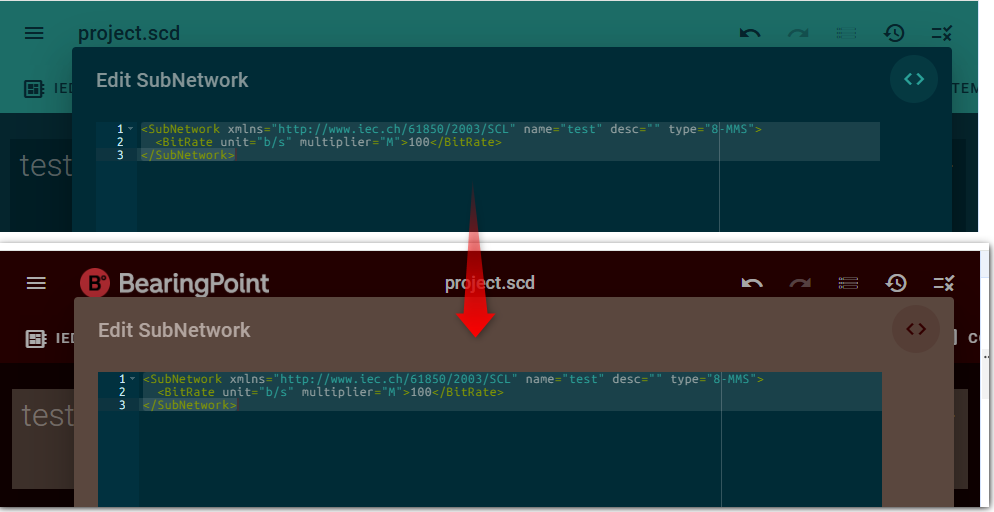

# ADR-0007 — Use `@omicronenergy/oscd-ui` `<oscd-ace-editor>` in OpenSCD

Date: 2026-08-30

## Status

Proposed

## Story

**As a** host or plugin author that embeds an XML code editor  
**I want** one OpenSCD Ace wrapper whose theme reads `--oscd-*` tokens  
**so that** wizard code view and plugin editors follow host branding and light/dark without hard-coding Solarized, sqlserver, or a private theme file.

---

## Current problem

OpenSCD’s wizard code view still uses raw `<ace-editor>` (package `ace-custom-element`) and a built-in Solarized file:

```ts
// packages/openscd/src/wizard-dialog.ts
theme="ace/theme/solarized_${resolvedColorScheme(localStorage.getItem('theme'))}"
```

([com-pas/open-scd `wizard-dialog.ts` L339](https://github.com/com-pas/open-scd/blob/main/packages/openscd/src/wizard-dialog.ts#L339))

That has three gaps:

1. **Not branded.** Ace Solarized light/dark ignore `--oscd-base*` and `--oscd-*`.
2. **Two Ace theme ids.** Light and dark are `solarized_light` / `solarized_dark`. [ADR-0005](0005-customer-branding-and-dark-mode.md) already drives light/dark via `color-scheme` + CSS variables; the editor should follow those tokens with **one** theme id.
3. **Plugins diverge.** Each Ace host ships whatever it bundled:



| Consumer | Theme today | Where |
|---|---|---|
| OpenSCD wizard (Pro mode → code toggle) | `ace/theme/solarized_light` or `_dark` | `wizard-dialog.ts` + `ace-custom-element` |
| Source editor plugin | `ace/theme/oscd` (was inlined; now in oscd-ui) | [oscd-editor-source](https://github.com/OMICRONEnergyOSS/oscd-editor-source) |
| IED XML editor (`oscd-scl-dialogs`) | `ace/theme/sqlserver` (hard-coded default) | [OscdTextEditor.ts L22](https://github.com/OMICRONEnergyOSS/oscd-scl-dialogs/blob/main/OscdTextEditor.ts#L22) |

CoMPAS distributions often pull the IED editor as a git submodule. That plugin does not see OpenSCD’s wizard theme switch.

An earlier draft of this ADR proposed a new npm package `@openscd/ace-theme-oscd` that only registers `ace.define('ace/theme/oscd', …)` on `window.ace`. **That is obsolete.** Stephen merged the theme into **[oscd-ui](https://github.com/OMICRONEnergyOSS/oscd-ui)** as a full editor component and published it (`@omicronenergy/oscd-ui@0.0.20`). Demo: [Storybook — Editors / Ace editor](https://omicronenergyoss.github.io/oscd-ui/?path=/docs/editors-ace-editor--docs).

---

## Proposed solution

1. OpenSCD `packages/openscd` depends on `@omicronenergy/oscd-ui`.
2. `wizard-dialog.ts` renders `<oscd-ace-editor>` instead of `<ace-editor theme="ace/theme/solarized_…">`. Remove `resolvedColorScheme` for Ace.
3. Plugins that still use raw Ace (`oscd-editor-source`, `oscd-scl-dialogs` / IED) switch to `<oscd-ace-editor>` (or at least stop defaulting to sqlserver / Solarized).
4. **Do not** publish a separate `@openscd/ace-theme-oscd` package.

Host usage (global registration is fine inside OpenSCD):

```ts
import '@omicronenergy/oscd-ui/ace-editor/oscd-ace-editor.js';

html`<oscd-ace-editor .value=${xml}></oscd-ace-editor>`;
```

Distributions that only set `--oscd-theme-*` get a matching editor with no extra Ace theme work.

### Open question (theme colours)

oscd-ui currently paints syntax with `--oscd-primary` / `--oscd-secondary` (brand fills) and `--oscd-base*` (surfaces / body text). Alternative: use Solarized accents (`--oscd-blue`, `--oscd-cyan`, `--oscd-green`, …) for syntax so a dark corporate `--oscd-primary` does not make XML unreadable. Decide with Stephen; not a blocker for adopting the component.

---

## Acceptance criteria

- [ ] Wizard Pro-mode code view uses `<oscd-ace-editor>` from `@omicronenergy/oscd-ui`.
- [ ] No `ace/theme/solarized_*` in `wizard-dialog.ts`.
- [ ] Settings system / light / dark restyle the editor via `--oscd-*` without swapping Ace module ids.
- [ ] `ace-custom-element` is gone from the wizard path (and from the package if unused).
- [ ] Lit 2 host + Lit 3 oscd-ui Ace is checked once (load, type, edit, save).
- [ ] oscd-editor-source and oscd-scl-dialogs (IED) are tracked as follow-ups to the same component; sqlserver/Solarized are no longer their defaults.

---

## Out of scope

- Rewriting the whole OpenSCD shell to oscd-ui Material components.
- Unifying every plugin’s Ace version in this PR.
- Status-token extras in Ace CSS beyond [ADR-0006](0006-customer-branding-add-status-color-tokens.md); keep oscd-ui fallbacks until then.

---

## References

- [Storybook oscd-ace-editor](https://omicronenergyoss.github.io/oscd-ui/?path=/docs/editors-ace-editor--docs)
- [npm `@omicronenergy/oscd-ui`](https://www.npmjs.com/package/@omicronenergy/oscd-ui) (Ace export from 0.0.20)
- [OscdAceEditor.ts](https://github.com/OMICRONEnergyOSS/oscd-ui/blob/main/ace-editor/OscdAceEditor.ts)
- [wizard-dialog.ts L339](https://github.com/com-pas/open-scd/blob/main/packages/openscd/src/wizard-dialog.ts#L339)
- [oscd-scl-dialogs `OscdTextEditor.ts` (`sqlserver`)](https://github.com/OMICRONEnergyOSS/oscd-scl-dialogs/blob/main/OscdTextEditor.ts#L22)
