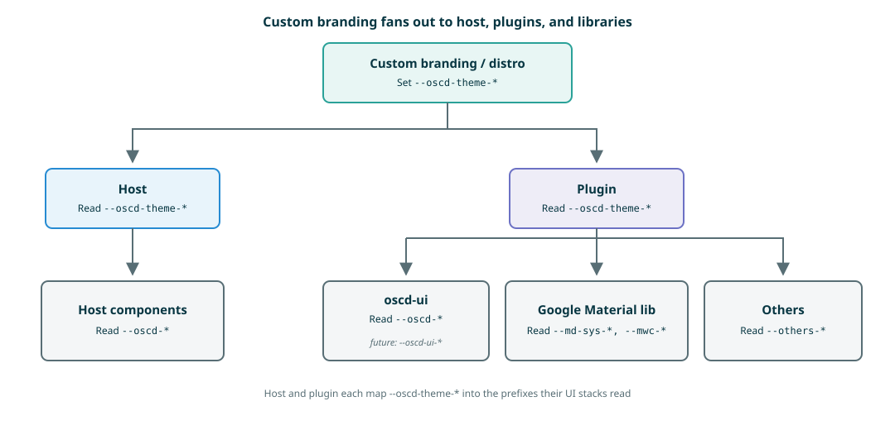

# Plugin theming

The portable input is `--oscd-theme-*` from the host / distro ([customer-branding.md](./customer-branding.md)).
Do **not** set `--oscd-theme-*` in the plugin. Map it once at the plugin root into the prefixes your UI libraries expect.

This host also publishes resolved `--oscd-*` for compatibility. Portable plugins must still initialize from `--oscd-theme-*` with fallbacks so they work on other hosts (for example oscd-shell).

Old-host workarounds and brand-id queries: [plugin-theming-advanced.md](./plugin-theming-advanced.md).
Status colors beyond `--oscd-theme-error` and `--oscd-theme-warning`: [ADR-0006](../decisions/0006-customer-branding-add-status-color-tokens.md).

## Layers

Custom branding fans out to the host and to each plugin. The plugin then maps into its libraries. It is not a pipeline through the host.



| Layer | Tokens | Who |
|---|---|---|
| Custom branding / distro | `--oscd-theme-*` | Distro CSS. Portable contract. |
| Host | `--oscd-*`, `--oscd-internal-*` | Host chrome. Plugins must not depend on these. |
| Plugin | maps `--oscd-theme-*` → library prefixes | Plugin root. |
| oscd-ui | `--oscd-*` (planned rename `--oscd-ui-*`) | Shared OpenSCD UI, including Ace. |
| Google Material lib | `--md-sys-*`, `--mwc-*` | Material components used by the plugin. |
| Others | e.g. `--others-*` | Any other UI stack. |

## Quick start

**Prefer the [Solarized](https://ethanschoonover.com/solarized/) palette (`--oscd-theme-base03` … `--oscd-theme-base3`) together with `--oscd-theme-primary` and `--oscd-theme-secondary`.**
Surfaces and text from the bases; brand fills from primary / secondary. Contrast on those fills is `--oscd-theme-base2` or `--oscd-theme-base3`.

Initialize at the plugin root, then consume the internals in the rest of the plugin:

```css
:root,
:host {

  /* Helper "--my-internal-*" tokens, so that fallbacks and defaults has only to be assigned once. */
  --my-internal-primary: var(--oscd-theme-primary, #2aa198);
  --my-internal-secondary: var(--oscd-theme-secondary, #6c71c4);
  --my-internal-error: var(--oscd-theme-error, #dc322f);

  --my-internal-base03: var(--oscd-theme-base03, light-dark(#002b36, #fdf6e3));
  --my-internal-base02: var(--oscd-theme-base02, light-dark(#073642, #eee8d5));
  --my-internal-base01: var(--oscd-theme-base01, light-dark(#586e75, #93a1a1));
  --my-internal-base00: var(--oscd-theme-base00, light-dark(#657b83, #839496));
  --my-internal-base0: var(--oscd-theme-base0, light-dark(#839496, #657b83));
  --my-internal-base1: var(--oscd-theme-base1, light-dark(#93a1a1, #586e75));
  --my-internal-base2: var(--oscd-theme-base2, light-dark(#eee8d5, #073642));
  --my-internal-base3: var(--oscd-theme-base3, light-dark(#fdf6e3, #002b36));

  --my-internal-yellow: var(--oscd-theme-yellow, #b58900);
  --my-internal-orange: var(--oscd-theme-orange, #cb4b16);
  --my-internal-red: var(--oscd-theme-red, #dc322f);
  --my-internal-magenta: var(--oscd-theme-magenta, #d33682);
  --my-internal-violet: var(--oscd-theme-violet, #6c71c4);
  --my-internal-blue: var(--oscd-theme-blue, #268bd2);
  --my-internal-cyan: var(--oscd-theme-cyan, #2aa198);
  --my-internal-green: var(--oscd-theme-green, #859900);
  --my-internal-warning: var(--oscd-theme-warning, var(--my-internal-yellow));

  --my-internal-text-font: var(--oscd-theme-text-font, 'Roboto');
  --my-internal-text-font-mono: var(--oscd-theme-text-font-mono, 'Roboto Mono');
  --my-internal-icon-font: var(--oscd-theme-icon-font, 'Material Symbols Outlined');
  
  --my-internal-shape: var(--oscd-theme-shape, 8px);
  --my-internal-shape-none: 0;
  --my-internal-shape-extra-small: calc(0.5 * var(--my-internal-shape)); /* 4px */
  --my-internal-shape-small: var(--my-internal-shape); /* 8px */
  --my-internal-shape-medium: calc(1.5 * var(--my-internal-shape)); /* 12px */
  --my-internal-shape-large: calc(2 * var(--my-internal-shape)); /* 16px */

  /* then set the tokens for your used libraries */
  /* Google Material */
  --md-sys-color-primary: var(--my-internal-primary);
  --md-sys-color-on-primary: var(--my-internal-base3);
  --md-sys-color-secondary: var(--my-internal-secondary);
  --md-sys-color-on-secondary: var(--my-internal-base3);
  --md-sys-color-surface: var(--my-internal-base3);
  --md-sys-color-on-surface: var(--my-internal-base00);
  --md-sys-color-error: var(--my-internal-error);
  --md-sys-shape-corner-none: var(--my-internal-shape-none);
  --md-sys-shape-corner-extra-small: var(--my-internal-shape-extra-small);
  --md-sys-shape-corner-small: var(--my-internal-shape-small);
  --md-sys-shape-corner-medium: var(--my-internal-shape-medium);
  --md-sys-shape-corner-large: var(--my-internal-shape-large);

  /* oscd-ui (planned rename `--oscd-ui-*`) */
  --oscd-primary: var(--my-internal-primary);
  --oscd-secondary: var(--my-internal-secondary);
  --oscd-error: var(--my-internal-error);
  --oscd-warning: var(--my-internal-warning);
  --oscd-base03: var(--my-internal-base03);
  --oscd-base02: var(--my-internal-base02);
  --oscd-base01: var(--my-internal-base01);
  --oscd-base00: var(--my-internal-base00);
  --oscd-base0: var(--my-internal-base0);
  --oscd-base1: var(--my-internal-base1);
  --oscd-base2: var(--my-internal-base2);
  --oscd-base3: var(--my-internal-base3);
  --oscd-yellow: var(--my-internal-yellow);
  --oscd-orange: var(--my-internal-orange);
  --oscd-red: var(--my-internal-red);
  --oscd-magenta: var(--my-internal-magenta);
  --oscd-violet: var(--my-internal-violet);
  --oscd-blue: var(--my-internal-blue);
  --oscd-cyan: var(--my-internal-cyan);
  --oscd-green: var(--my-internal-green);
  --oscd-text-font: var(--my-internal-text-font);
  --oscd-text-font-mono: var(--my-internal-text-font-mono);
  --oscd-icon-font: var(--my-internal-icon-font);
  --oscd-shape: var(--my-internal-shape);
}
```

Drop mappings you do not need. If you only use oscd-ui, you can map `--oscd-theme-*` → `--oscd-*` directly and skip `--my-internal-*`.

The table names the **theme roles**. After the mapping, paint with `--my-internal-*` (or the library prefix) so you do not repeat fallbacks. Do not write `var(--oscd-theme-primary)` in component CSS without a fallback — a distro is not required to set it.

| Use | Tokens | Description |
|---|---|---|
| Surfaces and body text | `--oscd-theme-base03` … `--oscd-theme-base3` | [Solarized](https://ethanschoonover.com/solarized/) scale; inverts in dark mode. |
| Accent text | `--oscd-theme-yellow` … `--oscd-theme-green` | [Solarized](https://ethanschoonover.com/solarized/) accents. Fixed hues; readable on both light and dark surfaces. |
| Brand buttons | `--oscd-theme-primary`, `--oscd-theme-secondary` | Button fills. Default cyan / violet; hosts may set `light-dark()`. |
| Text on brand fill | `--oscd-theme-base2` or `--oscd-theme-base3` | Contrast on primary / secondary. |
| Error | `--oscd-theme-error` | Error fill. |
| Warning | `--oscd-theme-warning` | Warning fill. Defaults to Solarized yellow. |
| Fonts | `--oscd-theme-text-font`, `--oscd-theme-text-font-mono`, `--oscd-theme-icon-font` | Text, monospace, and icon fonts. |
| Shape | `--oscd-theme-shape` | Corner radius (Material **small**). |

Do **not** set `--oscd-theme-*`. Do **not** read `--oscd-internal-*` or `--oscd-theme-nav-*`. App-bar colors are host-only.

## `--oscd-theme-*` tokens

These are the portable tokens a distro may set. The distro is not required to set them, so always consume them with a fallback (as in the quick start).

`--oscd-theme-nav-*` and `--oscd-theme-body-bg` are host-only ([customer-branding.md](./customer-branding.md)). `--oscd-theme-branding` is an optional brand id ([plugin-theming-advanced.md](./plugin-theming-advanced.md)).

| Key | Default | Description | Theme |
|---|---|---|---|
| `--oscd-theme-base03` | `light-dark(#002b36, #fdf6e3)` | [Solarized](https://ethanschoonover.com/solarized/) darkest/lightest. | Light/Dark |
| `--oscd-theme-base02` | `light-dark(#073642, #eee8d5)` | [Solarized](https://ethanschoonover.com/solarized/) base02. | Light/Dark |
| `--oscd-theme-base01` | `light-dark(#586e75, #93a1a1)` | [Solarized](https://ethanschoonover.com/solarized/) base01. | Light/Dark |
| `--oscd-theme-base00` | `light-dark(#657b83, #839496)` | [Solarized](https://ethanschoonover.com/solarized/) base00. | Light/Dark |
| `--oscd-theme-base0` | `light-dark(#839496, #657b83)` | [Solarized](https://ethanschoonover.com/solarized/) base0. | Light/Dark |
| `--oscd-theme-base1` | `light-dark(#93a1a1, #586e75)` | [Solarized](https://ethanschoonover.com/solarized/) base1. | Light/Dark |
| `--oscd-theme-base2` | `light-dark(#eee8d5, #073642)` | [Solarized](https://ethanschoonover.com/solarized/) UI surface / contrast on primary. | Light/Dark |
| `--oscd-theme-base3` | `light-dark(#fdf6e3, #002b36)` | [Solarized](https://ethanschoonover.com/solarized/) lightest/darkest. | Light/Dark |
| `--oscd-theme-yellow` | `#b58900` | [Solarized](https://ethanschoonover.com/solarized/) yellow. | Fixed |
| `--oscd-theme-orange` | `#cb4b16` | [Solarized](https://ethanschoonover.com/solarized/) orange. | Fixed |
| `--oscd-theme-red` | `#dc322f` | [Solarized](https://ethanschoonover.com/solarized/) red. | Fixed |
| `--oscd-theme-magenta` | `#d33682` | [Solarized](https://ethanschoonover.com/solarized/) magenta. | Fixed |
| `--oscd-theme-violet` | `#6c71c4` | [Solarized](https://ethanschoonover.com/solarized/) violet. | Fixed |
| `--oscd-theme-blue` | `#268bd2` | [Solarized](https://ethanschoonover.com/solarized/) blue. | Fixed |
| `--oscd-theme-cyan` | `#2aa198` | [Solarized](https://ethanschoonover.com/solarized/) cyan. | Fixed |
| `--oscd-theme-green` | `#859900` | [Solarized](https://ethanschoonover.com/solarized/) green. | Fixed |
| `--oscd-theme-primary` | `--oscd-theme-cyan` | Plugin brand fill. | Either |
| `--oscd-theme-secondary` | `--oscd-theme-violet` | Second plugin brand fill. | Either |
| `--oscd-theme-error` | `--oscd-theme-red` | Error fill. | Fixed |
| `--oscd-theme-warning` | `--oscd-theme-yellow` | Warning fill. | Fixed |
| `--oscd-theme-text-font` | `'Roboto'` | Text font. | Fixed |
| `--oscd-theme-text-font-mono` | `'Roboto Mono'` | Monospace font. | Fixed |
| `--oscd-theme-icon-font` | `'Material Symbols Outlined'` | Icon font. | Fixed |
| `--oscd-theme-shape` | `8px` | Corner radius (Material **small**). Plugins that use MD3 map `--md-sys-shape-corner-*` from this. | Fixed |

## Light / dark support

The host sets `color-scheme` on `<html>` (`light`, `dark`, or `light dark` for system default). Prefer the [Solarized](https://ethanschoonover.com/solarized/) `--oscd-theme-base*` fallbacks (then `--my-internal-base*`): they already invert.

```css
background: light-dark(#fff, #000);
```

## `color-mix`

Need more steps than the named tokens? Mix them instead of new hexes:

```css
--paper: light-dark(#fff, #000);
background: color-mix(in oklab, var(--my-internal-base03) 50%, var(--paper));
```

## Contrast

Pair a **fill** with contrast from the [Solarized](https://ethanschoonover.com/solarized/) scale. Do not invent a third color for text on a branded fill. After the root mapping, use `--my-internal-*` in rules:

| Fill (background) | Contrast (text / icon) | Description |
|---|---|---|
| `--my-internal-primary` | `--my-internal-base2` or `--my-internal-base3` | Default cyan already contrasts in both modes. |
| `--my-internal-secondary` | `--my-internal-base2` or `--my-internal-base3` | Same for violet. |
| `--my-internal-base3` | `--my-internal-base00` | Example of the 4-step minimum on the [Solarized](https://ethanschoonover.com/solarized/) ramp |
| `--my-internal-base1` | `--my-internal-base02` | Example of the 4-step minimum on the [Solarized](https://ethanschoonover.com/solarized/) ramp |

`--oscd-theme-base03` … `--oscd-theme-base3` is the [Solarized](https://ethanschoonover.com/solarized/) ramp **folded through** `light-dark()`, so plugins can keep using `base3` as “surface” and `base00` as “body text” in both modes.

**Minimum gap: 4 steps** on that scale (for example `--my-internal-base2` with `--my-internal-base00`). Adjacent steps are not enough for text.

For a button: fill as `background`, contrast token as `color`, and the **same contrast token** as `border-color`.

## What not to do

- Do not set `--oscd-theme-*` inside the plugin.
- Do not rely on the host having published `--oscd-*`. Initialize them (or your own library prefix) from `--oscd-theme-*` with a fallback.
- Do not use `--oscd-internal-*` or `--oscd-theme-nav-*`. Nav / app-bar colors are host chrome.
- Unprefixed tokens (`--primary`, `--base03`, `--cyan`, …) exist only for compatibility and will be removed.
- `--md-sys-*` / `--mwc-*` are for the Material library after you map them. They are not the portable OpenSCD contract.

Old hosts and `--oscd-theme-branding`: [plugin-theming-advanced.md](./plugin-theming-advanced.md).
